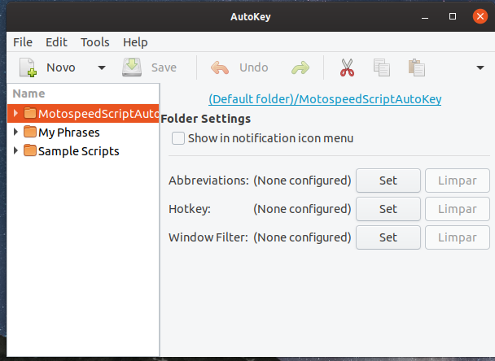
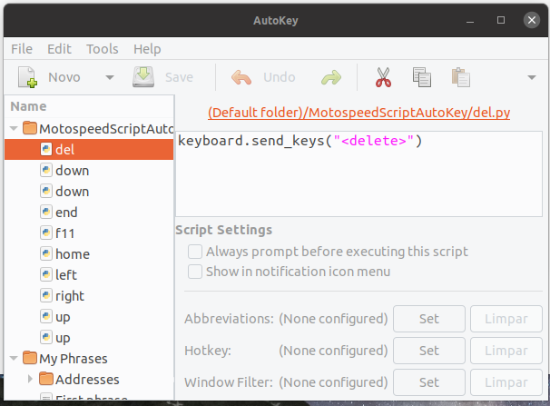
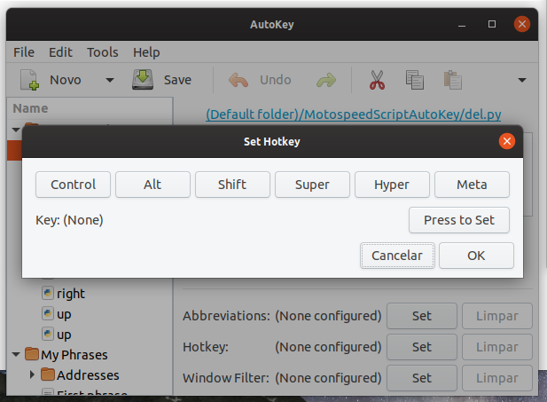

<h1 align="center">Welcome to Motospeed CK62 Atalhos Teclas 👋</h1>

  

Se voce chegou ate aqui acredito que voce encontrou alguns problemas com as teclas do seu CK62.

Bom, se voce nao sabe do que estou falando vou te explicar.

O [Teclado mecanico, Motospeed CK62](https://www.motospeedbrasil.com.br/ck62), é um excelente teclado, porém o ponto negativo dele é que para podermos utlizar algumas teclas como as de direcao, é necessario que vc segure o <code>FN + 3</code> por cerca de 5 segundos mais ou menos até que o led do botao apague e acenda novamente, a partir dai voce ja pode utilizar as teclas de direcao. O mesmo acontece para: delete, home, end e os botoes do F1 até F12, para quem esta programando fica muito chato.

## Solucao
Depois de muita pesquisa, encontrei programa chamado AutoKey, ele é utilizado para criar atalhos de teclados e atalhos de textos, quem já utiliza alguns snippets no vscode para completar codigos sabe bem como isso funciona. 

Dentro do AutoKey, é possivel criar scripts, e acionar esses scripts na maquina com um conjunto de teclas, por exemplo, poderia criar um script para abrir algum programa e definir as teclas Ctrl + O como atalho para abrir esse programa, todos esses scripts sao escritos em Python e utiliza o [Keyboard](https://pypi.org/project/keyboard/) para emitir essas acoes.

Sabendo disso, pude criar alguns scripts que ao pressionar a tecla Alt + W ou Alt + S internamente ele iria pressionar o botao Up e Down respectivamente, a partir dai voce ja deve ter imaginado o que eu fiz, criei varios atalhos no teclado e selecionei algumas acoes especificas, totalmente personalizado para meu uso, sem a necessidade de ficar pressionando <code>FN</code> e esperando 5 segundos para poder habilitar um conjunto de teclas, utilizalos e em seguida pressionar novamente para desabilita-las.

Deixei o meu Atalhos de Teclas dessa forma:

Botao Delete : Alt + Del
Botao Home : Alt + Home
Botao End : Alt + End
Botao Up : Alt + W
Botao Down : Alt + S
Botao Left : Alt + A
Botao Right : Alt + D
Botao F11: Alt + -

### Instalacao do AutoKey
       sudo apt-get install -y autokey-gtk

Apos instalacao basta abrir o programa:

Agora, basta baixar a pasta <code>MotospeedScriptAutoKey</code> que deixei nesse repositório, ir até <code>/home/< SEU NOME DE USUARIO >/.config/autokey/data/</code> e copiar a pasta para esse diretorio.

Feche o AutoKey e abra novamente, espero que todos os atalhos do teclado para executar o scripts já estejam incluso, caso contrario faca o seguinte:

Selecione um script como na imagem:

Clique em set da opcao HotKey, abrira o seguinte pop-up:

Clique em <code>press to set</code>, em seguida basta aperta as teclas de atalho que vc deseja, Clique em Ok em seguida clique em Save e esta tudo certo.

### Artigos Importantes

[https://www.maketecheasier.com/autokey-make-your-own-keyboard-shortcuts-in-linux/](https://www.maketecheasier.com/autokey-make-your-own-keyboard-shortcuts-in-linux/)

## Author

👤 **Marcelo Silva**

* Twitter: [@marcelxsilva](https://twitter.com/marcelxsilva)

Give a ⭐️ if this project helped you!